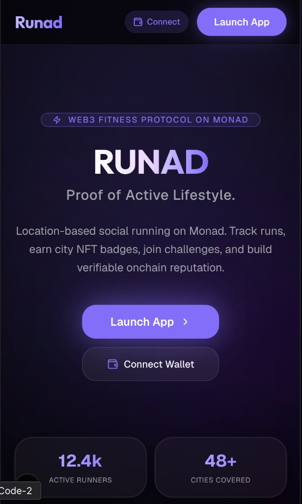
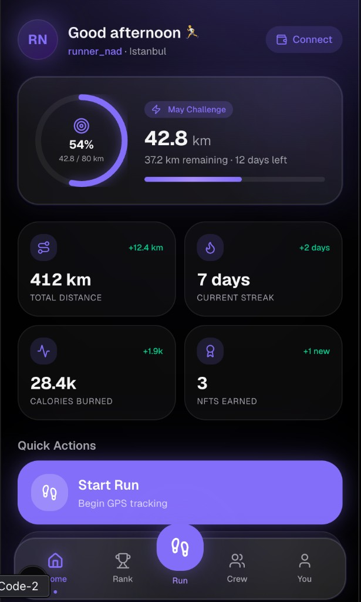
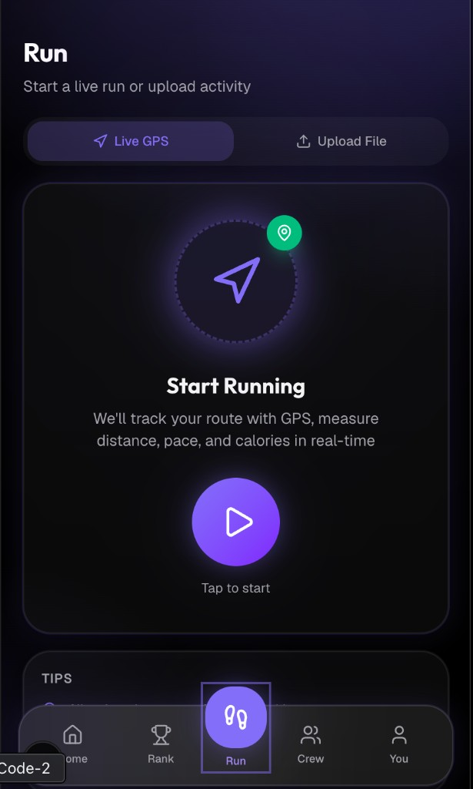
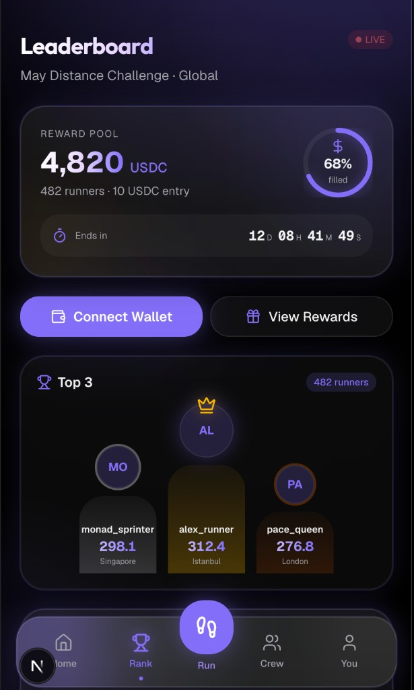
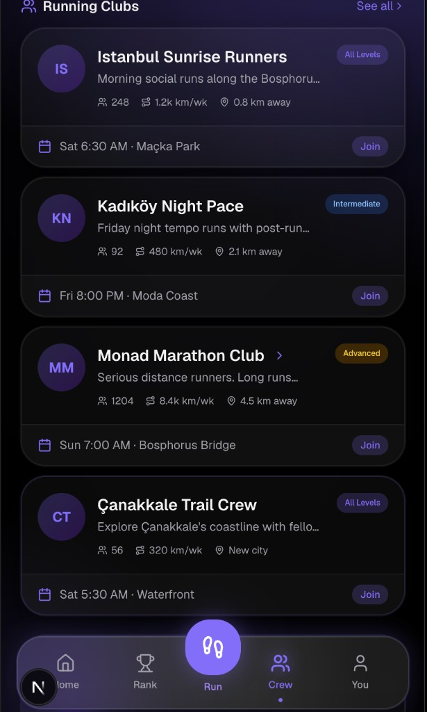
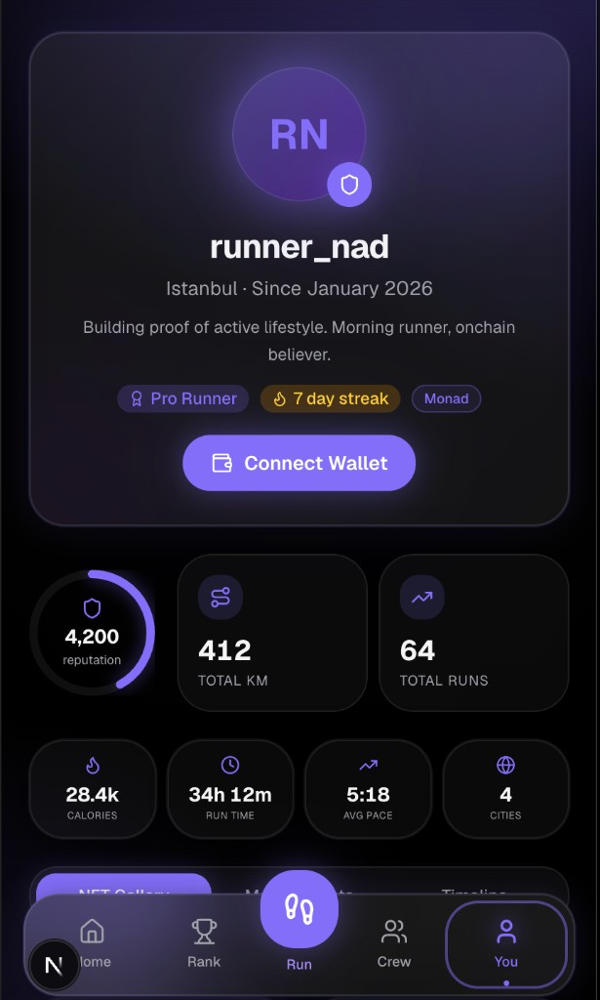

<div align="center">

# 🏃‍♂️ RUNAD

### Proof of Active Lifestyle

**Web3 social running protocol on [Monad](https://monad.xyz) — track runs, earn city NFT badges, join challenges, and build verifiable onchain reputation.**

[](https://runad.vercel.app)
[](https://github.com/EnsarEness/RUNAD)

<br />

[](https://nextjs.org)
[](https://typescriptlang.org)
[](https://tailwindcss.com)
[](https://monad.xyz)
[](https://supabase.com)
[](https://vercel.com)
[](https://web.dev/progressive-web-apps/)
[](LICENSE)

<br />

> 🏆 **Built at [Monad Blitz Çanakkale 2026](https://monad.xyz) Hackathon**

</div>

---

## 📖 Table of Contents

- [Overview](#-overview)
- [Features](#-features)
- [Screenshots](#-screenshots)
- [Tech Stack](#-tech-stack)
- [Architecture](#-architecture)
- [Getting Started](#-getting-started)
- [Environment Variables](#-environment-variables)
- [Database Setup](#-database-setup)
- [Project Structure](#-project-structure)
- [Deployment](#-deployment)
- [Roadmap](#-roadmap)
- [Team](#-team)
- [Contributing](#-contributing)
- [License](#-license)

---

## 🌟 Overview

**RUNAD** is a mobile-first Web3 fitness application that transforms every run into verifiable, onchain proof of an active lifestyle. Built on the [Monad blockchain](https://monad.xyz), it merges real-world fitness tracking with Web3 primitives — NFT achievements, token-backed challenges, and decentralized reputation.

Unlike "move-to-earn" games, RUNAD focuses on **proof of effort**: your running history becomes a permanent, verifiable record on Monad. No speculation. No Ponzi mechanics. Just real runners building real reputation.

### How It Works

```
Connect Wallet → Track Run (GPS / GPX Import) → Save Onchain → Earn NFT Badges → Join Challenges → Build Reputation
```

| Step | Action | Detail |
|:----:|--------|--------|
| 🔗 | **Connect** | Link your Monad wallet (MetaMask, injected providers) |
| 🏃 | **Run** | Track via real-time GPS or import GPX files from Strava/Garmin/Nike |
| 💾 | **Record** | Run data saved to Supabase with wallet attribution |
| 🎖️ | **Earn** | Mint city-specific NFT achievement badges |
| 🏆 | **Compete** | Join monthly challenges with USDC bounty pools |
| ⭐ | **Prove** | Build onchain reputation as a verified active runner |

---

## ✨ Features

### 🗺️ Real-Time GPS Run Tracking
Live GPS tracking with an interactive map powered by Leaflet. See your route drawn in real-time, with live stats for distance, pace, duration, calories, and average speed. Haversine-formula distance calculation ensures accuracy.

### 📂 GPX File Import
Import runs from **Strava**, **Garmin Connect**, **Nike Run Club**, or any app that exports standard GPX files. The built-in parser extracts track points, elevation data, timestamps, and computes all stats automatically.

### 💳 Monad Wallet Integration
Real wallet connection on **Monad Testnet** (Chain ID: `10143`) using wagmi v3 + viem v2. Support for MetaMask and injected wallet providers. Real MON token transactions for challenge entry fees.

### 🎖️ City NFT Achievements
Location-based NFT badge system. Run in different cities around the world and collect unique, tradeable NFT badges with rarity tiers:

| Rarity | Requirement | Badge |
|--------|-------------|-------|
| 🟢 Common | 1–5 runs in a city | Tier I |
| 🔵 Rare | 6–15 runs | Tier II |
| 🟣 Epic | 16–25 runs | Tier III |
| 🟡 Legendary | 26+ runs | Tier IV |

### 🏆 Monthly Challenge Leaderboards
Community challenges with USDC bounty pools. Runners pay an entry fee in MON, compete on distance-based leaderboards, and winners earn from the prize pool. Challenge types include distance goals, time trials, and streak challenges.

### 👥 Community Running Clubs
Discover and join local running crews. Each club has a dedicated detail page with member count, upcoming runs, and activity feeds. Build real connections through shared effort.

### 📊 Runner Dashboard
Comprehensive stats dashboard with animated metrics, progress rings, weekly distance charts, and quick actions. Your personal command center for all things running.

### 👤 Onchain Runner Profile
Your wallet-linked profile showcasing total distance, run count, NFT collection, challenge history, and onchain reputation score. Verifiable proof that you run.

### 📱 Progressive Web App (PWA)
Installable on iOS and Android for a native app experience. Full offline-capable manifest with custom icons, splash screen, and standalone display mode.

### 🎨 Dark Futuristic UI
Handcrafted glassmorphism design system with neon glow effects, gradient orbs, animated grid overlays, scroll-reveal animations, and a monad-purple accent palette. Built with custom components — no template.

---

## 📸 Screenshots

<div align="center">

👉 **[Explore the full app at runad.vercel.app](https://runad.vercel.app)** 👈

</div>

<table>
  <tr>
    <td align="center"><b>Landing Page</b></td>
    <td align="center"><b>Dashboard</b></td>
    <td align="center"><b>GPS Tracking</b></td>
  </tr>
  <tr>
    <td></td>
    <td></td>
    <td></td>
  </tr>
  <tr>
    <td align="center"><b>Leaderboard</b></td>
    <td align="center"><b>Community</b></td>
    <td align="center"><b>Profile</b></td>
  </tr>
  <tr>
    <td></td>
    <td></td>
    <td></td>
  </tr>
</table>

---

## 🛠️ Tech Stack

| Layer | Technology | Purpose |
|-------|-----------|---------|
| **Framework** | [Next.js 16](https://nextjs.org) (App Router) | Server components, file-based routing, static export |
| **Language** | [TypeScript](https://typescriptlang.org) | End-to-end type safety |
| **Styling** | [Tailwind CSS v4](https://tailwindcss.com) + custom design system | Glassmorphism, neon glow, gradient utilities |
| **UI Components** | [shadcn/ui](https://ui.shadcn.com) + custom RUNAD components | Card, Badge, Button, Avatar, Progress, etc. |
| **Animations** | [Framer Motion](https://motion.dev) | Page transitions, scroll reveal, animated counters |
| **Blockchain** | [Monad Testnet](https://monad.xyz) (Chain 10143) | L1 EVM — fast, low-cost transactions |
| **Wallet** | [wagmi v3](https://wagmi.sh) + [viem v2](https://viem.sh) | Wallet connection, chain config, transactions |
| **Database** | [Supabase](https://supabase.com) (PostgreSQL) | Run storage, challenges, participants, RLS |
| **Maps** | [Leaflet](https://leafletjs.com) + [react-leaflet](https://react-leaflet.js.org) | GPS visualization, route rendering |
| **State** | [TanStack Query v5](https://tanstack.com/query) | Server state, caching, real-time sync |
| **Icons** | [Lucide React](https://lucide.dev) | Consistent icon library |
| **Deployment** | [Vercel](https://vercel.com) | Edge network, automatic deployments |
| **PWA** | Web App Manifest + Service Worker | Installable mobile experience |

---

## 🏗️ Architecture

```
┌─────────────────────────────────────────────────────────────────┐
│                        CLIENT (Browser / PWA)                   │
│                                                                 │
│  ┌──────────┐  ┌──────────┐  ┌───────────┐  ┌───────────────┐  │
│  │  Landing  │  │Dashboard │  │ Run Track │  │  Community    │  │
│  │   Page    │  │  + Stats │  │ GPS / GPX │  │  + Clubs      │  │
│  └────┬─────┘  └────┬─────┘  └─────┬─────┘  └──────┬────────┘  │
│       │              │              │               │           │
│  ┌────┴──────────────┴──────────────┴───────────────┴────────┐  │
│  │                    React (Next.js 16 App Router)          │  │
│  │         Providers: wagmi + TanStack Query + PWA           │  │
│  └──────────┬─────────────────────┬──────────────────────────┘  │
│             │                     │                             │
│  ┌──────────▼──────────┐  ┌──────▼──────────────────────┐      │
│  │   Wallet Layer      │  │   Data Layer                │      │
│  │   wagmi v3 + viem   │  │   Supabase Client           │      │
│  │   Monad Testnet     │  │   TanStack Query Cache      │      │
│  └──────────┬──────────┘  └──────┬──────────────────────┘      │
└─────────────┼────────────────────┼──────────────────────────────┘
              │                    │
              ▼                    ▼
    ┌─────────────────┐   ┌─────────────────┐
    │  Monad Testnet  │   │    Supabase     │
    │  Chain: 10143   │   │   PostgreSQL    │
    │  RPC + Explorer │   │   + RLS + API   │
    └─────────────────┘   └─────────────────┘
```

### Key Design Decisions

- **Static Export** — All pages are statically generated for maximum performance on Vercel's edge network
- **Client-Side Wallet** — Wallet interactions happen entirely in the browser via wagmi/viem; no private keys touch any server
- **Haversine GPS** — Distance calculations use the Haversine formula for accurate great-circle distance between GPS coordinates
- **Row-Level Security** — Supabase tables use RLS policies so data access is controlled at the database level
- **Mobile-First** — Every component is designed for 375px+ viewports first, then scales up

---

## 🚀 Getting Started

### Prerequisites

- **Node.js** ≥ 18.17
- **npm** ≥ 9 (or pnpm/yarn)
- A [Supabase](https://supabase.com) project (free tier works)
- A Monad-compatible wallet (e.g., MetaMask configured for Monad Testnet)

### Installation

```bash
# Clone the repository
git clone https://github.com/EnsarEness/RUNAD.git
cd RUNAD

# Install dependencies
npm install

# Set up environment variables (see below)
cp .env.example .env.local

# Run the development server
npm run dev
```

The app will be available at **http://localhost:3000**.

### Available Scripts

| Command | Description |
|---------|-------------|
| `npm run dev` | Start development server with hot reload |
| `npm run build` | Create optimized production build |
| `npm run start` | Start production server |
| `npm run lint` | Run ESLint across the codebase |

---

## 🔑 Environment Variables

Create a `.env.local` file in the project root:

```env
# Supabase
NEXT_PUBLIC_SUPABASE_URL=https://your-project.supabase.co
NEXT_PUBLIC_SUPABASE_ANON_KEY=your-supabase-anon-key

# (Optional) Supabase Service Role — only needed for admin operations
SUPABASE_SERVICE_ROLE_KEY=your-service-role-key
```

| Variable | Required | Description |
|----------|----------|-------------|
| `NEXT_PUBLIC_SUPABASE_URL` | ✅ | Your Supabase project URL |
| `NEXT_PUBLIC_SUPABASE_ANON_KEY` | ✅ | Supabase anonymous/public key |
| `SUPABASE_SERVICE_ROLE_KEY` | ❌ | Service role key for admin DB operations |

> 💡 Get these from your [Supabase Dashboard](https://supabase.com/dashboard) → Project Settings → API

---

## 🗄️ Database Setup

RUNAD uses Supabase (PostgreSQL) for data persistence. SQL migration scripts are provided in the `/scripts` directory.

### 1. Create Tables

Run these scripts in your [Supabase SQL Editor](https://supabase.com/dashboard):

**`scripts/setup-db.sql`** — Creates the `runs` table:
```sql
CREATE TABLE IF NOT EXISTS runs (
  id UUID DEFAULT gen_random_uuid() PRIMARY KEY,
  wallet_address TEXT NOT NULL,
  distance_meters REAL NOT NULL,
  duration_seconds INTEGER NOT NULL,
  pace TEXT,
  calories INTEGER,
  avg_speed REAL,
  positions JSONB,
  created_at TIMESTAMPTZ DEFAULT now()
);
```

**`scripts/setup-challenges.sql`** — Creates `challenges` and `challenge_participants` tables with full RLS policies.

### 2. Row-Level Security

Both scripts enable RLS with permissive policies for the hackathon MVP. For production, you should scope policies to authenticated users.

### 3. Quick Setup API

Alternatively, hit the setup endpoint after starting the dev server:
```
GET /api/setup-db
```

---

## 📁 Project Structure

```
RUNAD/
├── public/
│   ├── manifest.json          # PWA manifest
│   ├── icon-192.png           # PWA icon (192×192)
│   └── icon-512.png           # PWA icon (512×512)
├── scripts/
│   ├── setup-db.sql           # Runs table migration
│   └── setup-challenges.sql   # Challenges table migration
├── src/
│   ├── app/
│   │   ├── page.tsx           # Landing page (hero, features, CTA)
│   │   ├── layout.tsx         # Root layout (fonts, metadata, providers)
│   │   ├── globals.css        # Tailwind v4 + custom animations
│   │   ├── api/
│   │   │   └── setup-db/      # Database setup API route
│   │   └── (app)/             # App route group (authenticated views)
│   │       ├── layout.tsx     # App shell (gradient bg + bottom nav)
│   │       ├── loading.tsx    # Loading skeleton
│   │       ├── dashboard/     # Runner dashboard with stats
│   │       ├── run/           # GPS tracking + GPX upload
│   │       ├── leaderboard/   # Challenge leaderboards
│   │       ├── community/     # Running clubs + detail pages
│   │       ├── profile/       # Runner profile + reputation
│   │       └── mint/          # NFT badge minting
│   ├── components/
│   │   ├── ui/                # shadcn/ui base components
│   │   ├── runad/             # Custom design system components
│   │   │   ├── glass-card.tsx # Glassmorphism card
│   │   │   ├── neon-button.tsx# Neon glow button
│   │   │   ├── gradient-bg.tsx# Animated background
│   │   │   ├── logo.tsx       # RUNAD logo
│   │   │   ├── stat-pill.tsx  # Stat display pill
│   │   │   └── page-header.tsx# Consistent page headers
│   │   ├── layout/            # Layout components
│   │   │   ├── bottom-nav.tsx # Mobile bottom navigation
│   │   │   ├── mobile-container.tsx
│   │   │   └── page-wrapper.tsx
│   │   ├── dashboard/         # Dashboard-specific components
│   │   ├── landing/           # Landing page components
│   │   ├── map/               # Leaflet map components
│   │   │   ├── run-map.tsx    # Route visualization
│   │   │   └── dynamic-map.tsx# Dynamic import wrapper
│   │   ├── wallet/            # Wallet connect button
│   │   └── providers.tsx      # wagmi + TanStack Query providers
│   ├── hooks/
│   │   ├── use-gps-tracking.ts# Real-time GPS tracking hook
│   │   ├── use-save-run.ts   # Supabase run persistence
│   │   ├── use-challenges.ts # Challenge data hooks
│   │   └── use-wallet.ts     # Wallet state hook
│   └── lib/
│       ├── chain.ts           # Monad Testnet chain definition
│       ├── wagmi.ts           # wagmi config (chains, connectors)
│       ├── supabase.ts        # Supabase client
│       ├── gpx-parser.ts      # GPX file parser
│       ├── constants.ts       # App-wide constants
│       └── utils.ts           # Utility functions (cn, etc.)
├── .env.local                 # Environment variables (not committed)
├── next.config.ts             # Next.js configuration
├── tailwind.config.ts         # Tailwind CSS configuration
├── tsconfig.json              # TypeScript configuration
└── package.json               # Dependencies & scripts
```

---

## 🌐 Deployment

RUNAD is deployed on **Vercel** with zero-config Next.js support.

### Deploy to Vercel

[](https://vercel.com/new/clone?repository-url=https://github.com/EnsarEness/RUNAD&env=NEXT_PUBLIC_SUPABASE_URL,NEXT_PUBLIC_SUPABASE_ANON_KEY)

1. Click the button above or connect your GitHub repo to Vercel
2. Add the required environment variables in Vercel's dashboard
3. Deploy — Vercel handles the build automatically

### Manual Deployment

```bash
# Build for production
npm run build

# The output is in .next/ — deploy to any Node.js host
npm run start
```

### Monad Testnet Configuration

The app connects to Monad Testnet by default:

| Property | Value |
|----------|-------|
| **Chain ID** | `10143` |
| **Currency** | MON (18 decimals) |
| **RPC** | `https://testnet-rpc.monad.xyz` |
| **Explorer** | `https://testnet.monadexplorer.com` |

> Add Monad Testnet to MetaMask using the values above, or the app will prompt you automatically.

---

## 🗺️ Roadmap

### ✅ Phase 1 — MVP (Current)
- [x] Real-time GPS run tracking
- [x] GPX file import (Strava/Garmin/Nike)
- [x] Monad Testnet wallet connection
- [x] Run data persistence (Supabase)
- [x] City NFT achievement system (UI)
- [x] Monthly challenge leaderboards
- [x] Community running clubs
- [x] Runner profile & reputation
- [x] PWA support
- [x] Dark futuristic UI

### 🔨 Phase 2 — Smart Contracts
- [ ] Deploy NFT badge smart contract on Monad
- [ ] On-chain run verification with signed GPS data
- [ ] Challenge entry fees via smart contract escrow
- [ ] Automated USDC prize pool distribution
- [ ] Soulbound reputation tokens

### 🚀 Phase 3 — Token & Mainnet
- [ ] $RUNAD governance token
- [ ] Staking rewards for consistent runners
- [ ] Monad Mainnet deployment
- [ ] Cross-chain NFT bridging
- [ ] Running data oracle for DeFi integrations

### 📱 Phase 4 — Mobile & Social
- [ ] Native iOS & Android apps (React Native)
- [ ] Real-time run sharing & spectating
- [ ] In-app messaging for running clubs
- [ ] Strava / Garmin API direct sync
- [ ] AI-powered training plans
- [ ] Running route recommendations

---

## 👥 Team

Built with ❤️ at **Monad Blitz Çanakkale 2026** by:

| | Name | Role | Links |
|--|------|------|-------|
| 🧑‍💻 | **Ensar Enes Akkis** | Full-Stack Developer | [](https://github.com/EnsarEness) |

---

## 🤝 Contributing

Contributions are welcome! Here's how you can help:

1. **Fork** the repository
2. **Create** a feature branch (`git checkout -b feature/amazing-feature`)
3. **Commit** your changes (`git commit -m 'feat: add amazing feature'`)
4. **Push** to the branch (`git push origin feature/amazing-feature`)
5. **Open** a Pull Request

Please make sure to:
- Follow the existing code style (TypeScript strict mode)
- Use [Conventional Commits](https://www.conventionalcommits.org/) for commit messages
- Test your changes locally before submitting

---

## 📄 License

This project is licensed under the **MIT License** — see the [LICENSE](LICENSE) file for details.

---

<div align="center">

**[🌐 Live Demo](https://runad.vercel.app)** · **[📦 GitHub](https://github.com/EnsarEness/RUNAD)** · **[🐛 Report Bug](https://github.com/EnsarEness/RUNAD/issues)** · **[💡 Request Feature](https://github.com/EnsarEness/RUNAD/issues)**

<br />

<sub>Built with 🏃 on <a href="https://monad.xyz"><b>Monad</b></a> — Where every run counts.</sub>

</div>
